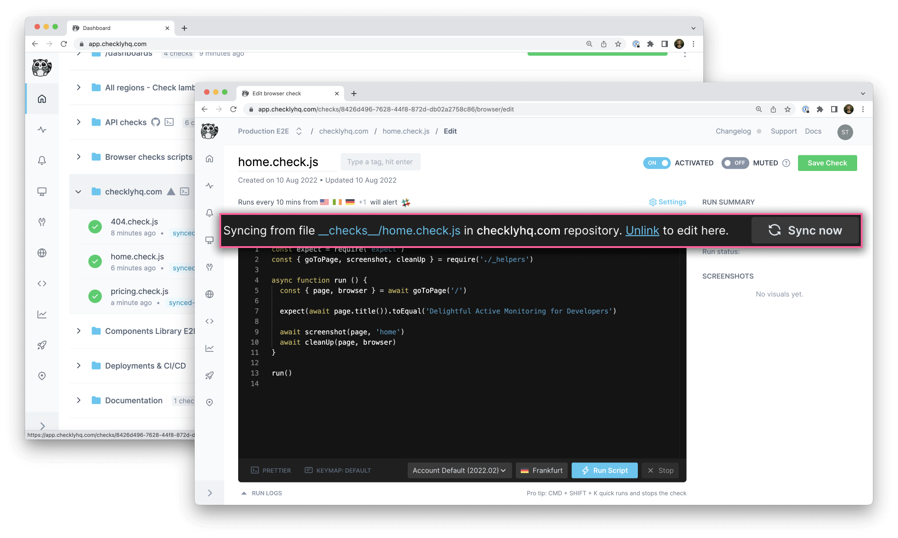

## Welcome to Checkly's example setup! 👋

> **Note**
> The described Checkly setup uses [GitHub Sync](https://www.checklyhq.com/docs/browser-checks/github-code-sync/). The feature's in a public beta and under active development.

[Please provide feedback on GitHub](https://github.com/orgs/checkly/discussions/3).



To keep our automated Browser checks up to date, `checklyhq.com` implements GitHub-synced Browser checks. The project leverages [the "sync on deployment" strategy](https://www.checklyhq.com/docs/browser-checks/github-code-sync/#sync-on-deployment) to refetch and update synchronized Browser checks after every successful production deployment.

## Project structure

Synced browser checks enable you to `require` local dependencies and reuse them across multiple Browser checks.

This project includes:

- [a `checkly.config.js` root file](https://github.com/checkly/checklyhq.com/blob/main/checkly.config.js) for shared config and defaults
- `*.check.js` files and utilities in the __checks__ directory to DRY up some common boilerplate

### Local development

To develop and test the Browser checks locally, this project includes the `playwright` and `expect` dependencies to match [the Checkly runtime dependencies](https://www.checklyhq.com/docs/runtimes/specs/).

Run each check locally using:

```bash
NODE_ENV=development node __checks__/pricing.check.js
```

## Further information

[Visit the GitHub Sync docs to find further information](https://www.checklyhq.com/docs/browser-checks/github-code-sync/).
